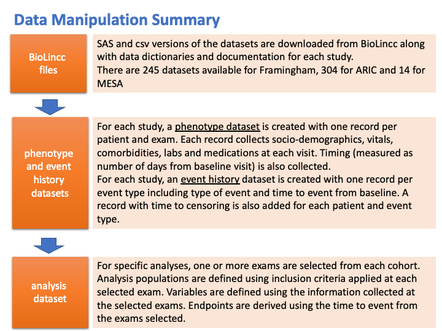

# Manual Harmonization for Stroke Risk Prediction Cohorts

## Data Manipulation Summary (BioLINCC)

## From Phenptype and Event Data to Analysis Dataset

1. Determine what visits (or exams) will be used from each cohort
2. Specify inclusion and exclusion criteria
3. Extract phenotype data for participants meeting the inclusion/exclusion criteria from phenotype dataset
4. Extract events from event history datasets including time relative to the visit (or exam) selected for analysis
5. Combine all the cohorts into an analysis dataset

## Detailed Procedure

Below we describe the series of steps necessary to convert the phenotype data, which is downloaded from the BioLINCC website, from raw form to final SAS analysis data sets. The steps described here pertain only to the cohort phenotype data, and assume that the downloaded phenotype files have already been placed in a local path with one subdirectory for each cohort (ARIC, Framingham Offspring and MESA).

Within each cohort subdirectory, the `/data` directory contains source data and document directories that were extracted directly from the `Archive.zip` file. All of the data files extracted from the zip file were already in SAS data format. No further manipulation of the source data was performed. All SAS datasets were input directly into the analysis data set programs for each cohort. The `/programs` directory contains the programs written to create the analysis datasets that are stored in the target `/analdata` directory.
To help assist in the understanding of variable creation, in addition to specifications written for the stroke prediction project see [[Pooled Cohort Overvew]](./Pooled_Cohort_overview_0917.xlsx).

For each cohort, two SAS analysis datasets were created. These datasets were also output as CSV files.

1. Phenotype (one record per patient per visit). For ARIC, Framingham Offspring, and MESA, the phenotype dataset program is called `pull_aric.sas`, `pull_offspring.sas` and `pull_mesa.sas`, respectively.
2. Events (one or more record per patient per event). For this dataset, the program (standard for all cohorts) outputs one censoring record for each event/procedure, even in the case where the event/procedure occurred. Note that if there are multiple events of the same type for a patient (say 4 MIs), all MI events will be kept, as well as the creation of the censoring record. If the patient had no MI events, the MI censoring record would still be created. For ARIC, Framingham Offspring, and MESA the events dataset program is called `pull_aric_events.sas`, `pull_offspring_events.sas`, and `pull_mesa_events.sas`, respectively.

# Links
- [BioLINCC]()
- [Framingham (Offspring)](https://biolincc.nhlbi.nih.gov/studies/framoffspring/)
- [ARIC](https://biolincc.nhlbi.nih.gov/studies/aric/)
- [MESA](https://biolincc.nhlbi.nih.gov/studies/mesa/)
